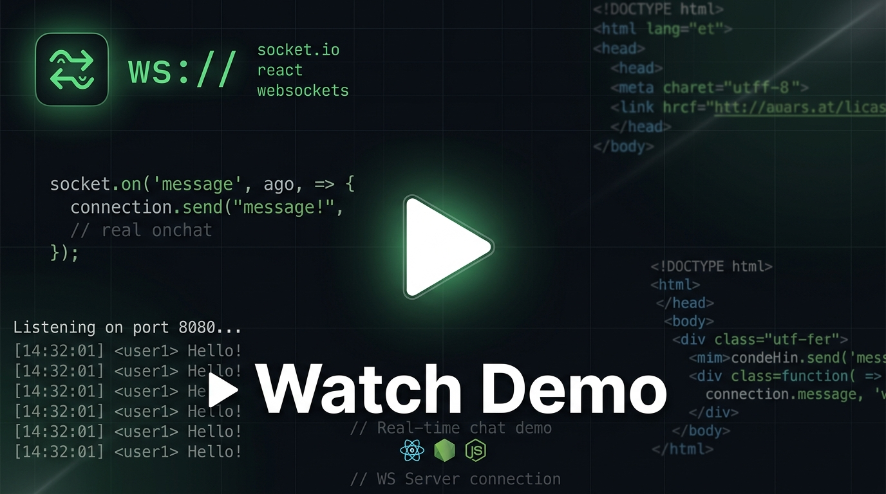

# 💬 Real-Time Chat App — WebSocket Server

A lightweight, room-based real-time chat server built with **Node.js**, **TypeScript**, and the **`ws`** WebSocket library. Clients can join named rooms and broadcast messages instantly to every other member of the same room.

---

## 🚀 Features

- ✅ Real-time bidirectional communication via WebSockets
- ✅ Room-based chat — users only receive messages from their own room
- ✅ Automatic cleanup on client disconnect
- ✅ Strict TypeScript typing for safety and maintainability
- ✅ Zero external runtime dependencies — pure Node.js + `ws`

---

## 🏗️ Architecture

### High-Level Overview

```
┌─────────────────────────────────────────────────┐
│                   CLIENTS                        │
│                                                  │
│  ┌──────────┐  ┌──────────┐  ┌──────────┐       │
│  │ Client A │  │ Client B │  │ Client C │  ...  │
│  │ (Room 1) │  │ (Room 1) │  │ (Room 2) │       │
│  └────┬─────┘  └────┬─────┘  └────┬─────┘       │
│       │              │              │             │
└───────┼──────────────┼──────────────┼─────────────┘
        │   WebSocket  │              │
        ▼              ▼              ▼
┌─────────────────────────────────────────────────┐
│           WebSocketServer  (port 8080)           │
│                                                  │
│  ┌──────────────────────────────────────────┐   │
│  │              alluser[]                    │   │
│  │  ┌──────────────┐  ┌──────────────┐      │   │
│  │  │ socket: A    │  │ socket: B    │  ... │   │
│  │  │ room: "1234" │  │ room: "1234" │      │   │
│  │  └──────────────┘  └──────────────┘      │   │
│  └──────────────────────────────────────────┘   │
└─────────────────────────────────────────────────┘
```

---

### Message Flow Diagram

#### 1️⃣ Joining a Room

```
Client                        Server
  │                              │
  │── { type: "join",           │
  │     payload: {              │
  │       roomId: "room-123"    │
  │     }                       │
  │   } ──────────────────────▶ │
  │                              │── push { socket, room } into alluser[]
  │                              │
  │◀──────── "joined room" ───── │
```

#### 2️⃣ Broadcasting a Chat Message

```
Client A (Room 1)             Server                     Client B (Room 1)
      │                          │                               │
      │── { type: "chat",        │                               │
      │     payload: {           │                               │
      │       message: "Hello!"  │                               │
      │     }                    │                               │
      │   } ───────────────────▶ │                               │
      │                          │── find currentRoom for A      │
      │                          │── loop alluser[]              │
      │                          │   if room === currentRoom     │
      │                          │     send message ───────────▶ │
      │◀─────── "Hello!" ─────── │                               │
      │   (A also receives it)   │                               │
```

#### 3️⃣ Client Disconnection

```
Client                        Server
  │                              │
  │── [connection closed] ─────▶ │
  │                              │── filter alluser[]
  │                              │   remove socket from array
  │                              │── (room cleaned up automatically)
```

---

### Component Diagram

```
┌──────────────────────────────────────────────┐
│                  index.ts                    │
│                                              │
│  ┌─────────────────────────────────────┐    │
│  │  WebSocketServer (port 8080)        │    │
│  │                                     │    │
│  │  Events:                            │    │
│  │  ├─ "connection" ──▶ registers      │    │
│  │  │                   socket handlers│    │
│  │  └─ per-socket:                     │    │
│  │      ├─ "message" ──▶ parse JSON    │    │
│  │      │    ├─ type="join"  ──▶ push  │    │
│  │      │    │                 to users│    │
│  │      │    └─ type="chat"  ──▶ fan-  │    │
│  │      │                      out msg │    │
│  │      └─ "close"  ──▶ remove from   │    │
│  │                       alluser[]     │    │
│  └─────────────────────────────────────┘    │
│                                              │
│  Data:                                       │
│  └─ alluser: user[]                          │
│       └─ user { socket: WebSocket,           │
│                 room: string }               │
└──────────────────────────────────────────────┘
```

---

## 📁 Project Structure

```
chat app/
├── src/
│   └── index.ts          # Main server — WebSocket logic
├── dist/
│   ├── index.js          # Compiled JavaScript output
│   ├── index.js.map      # Source map
│   ├── index.d.ts        # TypeScript declarations
│   └── index.d.ts.map    # Declaration source map
├── package.json          # Project config & scripts
├── tsconfig.json         # TypeScript compiler config
└── README.md             # You are here
```

---

## 📡 WebSocket Message Protocol

All messages are sent as **JSON strings**.

### Join a Room

```json
{
  "type": "join",
  "payload": {
    "roomId": "your-room-id"
  }
}
```

**Server response:** `"joined room"`

---

### Send a Chat Message

```json
{
  "type": "chat",
  "payload": {
    "message": "Hello, room!"
  }
}
```

**Server behavior:** Broadcasts the message text to **all** users currently in the same room (including the sender).

---

## ⚙️ Tech Stack

| Technology | Purpose |
|---|---|
| **Node.js** | Runtime environment |
| **TypeScript** | Type-safe development |
| **`ws` library** | WebSocket server implementation |
| **`@types/node`** | Node.js type definitions |

---

## 🛠️ Getting Started

### Prerequisites

- Node.js >= 18
- npm

### Installation

```bash
npm install
```

### Run the Server

```bash
npm run dev
```

The server starts on **`ws://localhost:8080`** and logs:

```
server is live
```

### Build Only

```bash
npx tsc -b
```

---

## 🔌 Testing with a WebSocket Client

You can test the server using any WebSocket client (e.g., Postman, `wscat`, or a browser console).

### Using `wscat`

```bash
# Terminal 1 — User A
npx wscat -c ws://localhost:8080
> {"type":"join","payload":{"roomId":"room1"}}
< joined room
> {"type":"chat","payload":{"message":"Hey everyone!"}}

# Terminal 2 — User B (same room)
npx wscat -c ws://localhost:8080
> {"type":"join","payload":{"roomId":"room1"}}
< joined room
< Hey everyone!
```

---

## 🔑 Key Implementation Details

| Aspect | Detail |
|---|---|
| **In-memory store** | `alluser[]` array holds all connected users with their room association |
| **Room lookup** | When a chat message arrives, the server finds the sender's room by matching their `socket` reference |
| **Fan-out** | The server loops through `alluser[]` and sends the message to every user whose `room` matches |
| **Cleanup** | On `close`, the disconnected socket is filtered out of `alluser[]` |
| **No persistence** | Messages are not stored; history is lost on server restart |

---

## ⚠️ Limitations & Future Improvements

- [ ] No authentication — any client can join any room with any ID
- [ ] No message history — messages are not persisted
- [ ] Single-server architecture — does not scale horizontally (no Redis pub/sub)
- [ ] No rate limiting — vulnerable to message flooding
- [ ] Sender exclusion — currently the sender also receives their own broadcast
- [ ] Room names are case-sensitive strings — no validation

---

## 🎥 Proof of Work

The demo below shows multiple WebSocket clients joining a room and exchanging real-time messages. Click the thumbnail to watch the video.

[](https://github.com/adityasrivastava19/chat-app-be/raw/main/2026-09-22%2022-55-36.mp4)

---

## 📄 License

ISC
